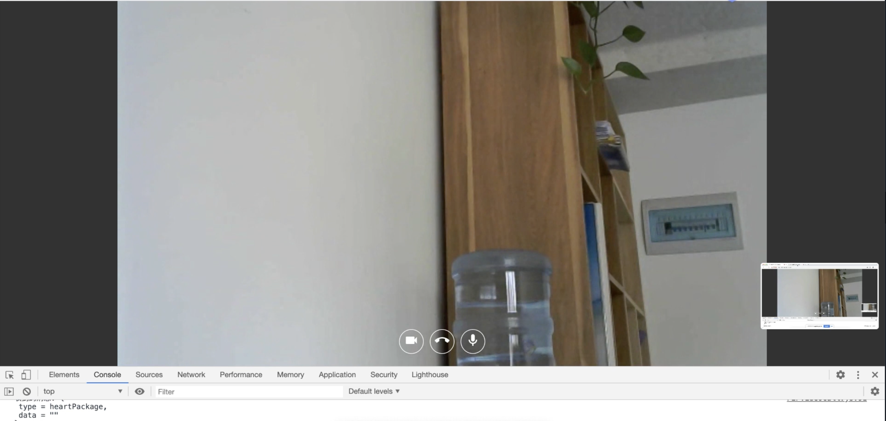

# Lobo one-on-one online meeting service
A simple WebRTC server and client. User can have a video meeting online by our service. The project contains the signal server and the web UI. You may also need a turn server to finish the project. [Reference](https://github.com/coturn/coturn)

## Feature
- A beautiful UI based on **React** and **AntDesign**
- Support multiple room
- Support screen share

## Code
p2p-server is a signal server for room management and signal transfer. \
p2p-h5 is the front-end UI. \
You may also need a Turn and Stun server. Here is a reference. https://github.com/coturn/coturn

## Screenshot

## Author
Lobo Bunny